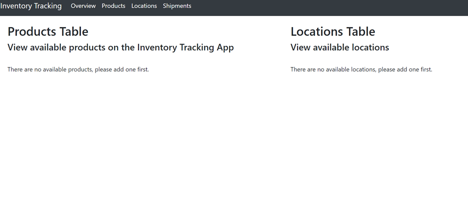
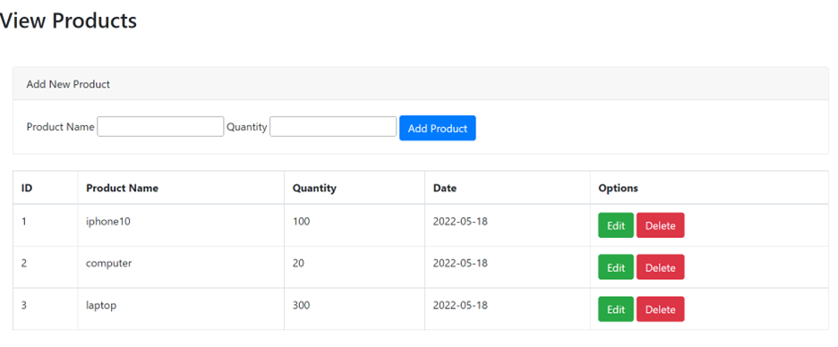

# Flask Inventory Tracking Management

This project is for [Shopify backend intern 2022 Challenge](https://docs.google.com/document/d/1PoxpoaJymXmFB3iCMhGL6js-ibht7GO_DkCF2elCySU/edit)

## Technologies
- Python
- Flask
- SQLALCHEMY
- WTForms
- HTML

## Key features
- View a list of available products and warehouses/locations 
- Add new products and warehouses
- Edit existing products and warehouses
- Delete existing products and warehouses
- Create "Shipment", assign available products to the shipment

## Get Started
- First, clone this repository and change your path to its folder.
```
git clone https://github.com/Elena-yang15/Inventory_flask.git
cd flask_inventory_tracking
```

- Then install all prerequirement.
```
pip install -r requirements.txt
```

- Run the app
```
python run.py
```

## Running the App
- The Overview Page shows the lists of available products and locations.



- Add new product


- Edit product


- Delete product


- View products and locations



- Create new shipment, select the product and locations from the database


- Error: Same From location and To location


- Error: Insufficient products for the shipment


